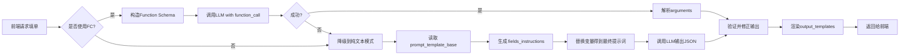

# 智能填单系统 - 详细设计文档

## 1. 项目概述

### 1.1 项目背景
智能填单系统是一个基于 FastAPI + Vue3 的中后台管理系统，支持多租户、RBAC权限管理、智能填单等功能。系统主要为话务工作台提供AI辅助填单能力，通过集成Dify平台和LLM大模型，实现智能化的表单自动填充。

### 1.2 系统定位
- **内部管理端**: 提供应用管理、字段组配置、字段明细管理等后台功能
- **对外服务层**: 为Dify工作流和第三方应用提供API接口服务
- **AI能力层**: 集成LiteLLM，支持多模型统一调用

### 1.3 技术栈

| 层级 | 技术 | 版本 |
|------|------|------|
| 前端 | Vue3 + TypeScript + Ant Design Vue + Vite | Vue3.5+, Vite8+ |
| 后端 | FastAPI + Tortoise ORM | FastAPI 0.111+ |
| 数据库 | MySQL | - |
| 缓存 | Redis | - |
| 消息队列 | Kafka | - |
| AI/LLM | LiteLLM + LangChain | - |

---

## 2. 系统架构设计

### 2.1 整体架构

```
┌─────────────────────────────────────────────────────────────────────────┐
│                              接入层                                       │
├─────────────────────────────────────────────────────────────────────────┤
│  ┌─────────────┐    ┌─────────────┐    ┌─────────────┐                 │
│  │  话务前端    │    │  Dify平台   │    │  第三方应用  │                 │
│  └──────┬──────┘    └──────┬──────┘    └──────┬──────┘                 │
└─────────┼──────────────────┼──────────────────┼─────────────────────────┘
          │                  │                  │
          ▼                  ▼                  ▼
┌─────────────────────────────────────────────────────────────────────────┐
│                           API网关层                                       │
├─────────────────────────────────────────────────────────────────────────┤
│  ┌─────────────────────────────────────────────────────────────────┐   │
│  │                     FastAPI Router                               │   │
│  │  ┌─────────────┐  ┌─────────────┐  ┌─────────────────────────┐  │   │
│  │  │ JWT认证     │  │ API Key认证 │  │ 权限控制 (RBAC)         │  │   │
│  │  │ (后台管理)  │  │ (公开接口)  │  │                         │  │   │
│  │  └─────────────┘  └─────────────┘  └─────────────────────────┘  │   │
│  └─────────────────────────────────────────────────────────────────┘   │
└─────────────────────────────────────────────────────────────────────────┘
          │
          ▼
┌─────────────────────────────────────────────────────────────────────────┐
│                           业务层                                         │
├─────────────────────────────────────────────────────────────────────────┤
│  ┌──────────────┐  ┌──────────────┐  ┌──────────────┐  ┌─────────────┐ │
│  │ 应用管理      │  │ 字段组配置    │  │ 字段明细管理  │  │ 填单记录    │ │
│  │ App Mgmt     │  │ Field Group  │  │ Field Spec   │  │ Record      │ │
│  └──────────────┘  └──────────────┘  └──────────────┘  └─────────────┘ │
│  ┌──────────────┐  ┌──────────────┐  ┌──────────────┐                  │
│  │ 总结模板      │  │ 下拉选项      │  │ LLM配置      │                  │
│  │ Template     │  │ Dropdown     │  │ LLM Config   │                  │
│  └──────────────┘  └──────────────┘  └──────────────┘                  │
└─────────────────────────────────────────────────────────────────────────┘
          │
          ▼
┌─────────────────────────────────────────────────────────────────────────┐
│                           服务层                                         │
├─────────────────────────────────────────────────────────────────────────┤
│  ┌─────────────────────────────────────────────────────────────────┐   │
│  │                      AI填单服务                                   │   │
│  │  ┌─────────────┐  ┌─────────────┐  ┌─────────────────────────┐  │   │
│  │  │ Prompt组装  │  │ LLM调用     │  │ 结构化输出解析          │  │   │
│  │  │ 引擎        │  │ (LiteLLM)   │  │                         │  │   │
│  │  └─────────────┘  └─────────────┘  └─────────────────────────┘  │   │
│  └─────────────────────────────────────────────────────────────────┘   │
│  ┌─────────────────────────────────────────────────────────────────┐   │
│  │                      LLM代理服务                                  │   │
│  │  ┌─────────────┐  ┌─────────────┐  ┌─────────────────────────┐  │   │
│  │  │ 配置管理    │  │ 多模型路由  │  │ Fallback机制            │  │   │
│  │  │             │  │             │  │                         │  │   │
│  │  └─────────────┘  └─────────────┘  └─────────────────────────┘  │   │
│  └─────────────────────────────────────────────────────────────────┘   │
└─────────────────────────────────────────────────────────────────────────┘
          │
          ▼
┌─────────────────────────────────────────────────────────────────────────┐
│                           数据层                                         │
├─────────────────────────────────────────────────────────────────────────┤
│  ┌──────────────┐  ┌──────────────┐  ┌──────────────┐                  │
│  │   MySQL      │  │    Redis     │  │    Kafka     │                  │
│  │  (主数据库)   │  │   (缓存)     │  │  (消息队列)   │                  │
│  └──────────────┘  └──────────────┘  └──────────────┘                  │
└─────────────────────────────────────────────────────────────────────────┘
```

### 2.2 模块划分

| 模块 | 职责 | 对应目录 |
|------|------|----------|
| 应用管理 | 管理应用基本信息、API Key、Dify配置 | `app/api/v1/autofill/` |
| 字段组配置 | 管理字段组定义、Prompt模板 | `app/models/autofill.py` |
| 字段明细 | 管理字段规格、基础描述、人工批注 | `app/models/autofill.py` |
| 填单页面 | 管理页面与应用的绑定关系 | 待实现 |
| 总结模板 | 管理总结类填单模板 | `app/models/autofill.py` |
| 下拉选项 | 管理下拉选项数据（支持树形结构） | `app/models/autofill.py` |
| 填单记录 | 管理填单数据记录、AI处理状态 | `app/models/autofill.py` |
| LLM配置 | 管理多租户LLM配置 | `app/models/llm_config.py` |

---

## 3. 数据模型设计

### 3.1 现有模型

#### 3.1.1 应用管理表 (AppManagement) ✅ 已实现

**文件位置**: `app/models/autofill.py`

```python
class AppManagement(BaseModel, TimestampMixin):
    app_name = fields.CharField(max_length=64, default="", description="应用名称(英文)", index=True)
    tenant_id = fields.BigIntField(default=0, description="租户ID", index=True)
    api_key = fields.CharField(max_length=64, default=generate_api_key, description="API密钥", unique=True)
    dify_url = fields.CharField(max_length=255, default="", description="Dify服务地址")
    dify_api_key = fields.CharField(max_length=128, default="", description="Dify API密钥")
    description = fields.CharField(max_length=255, null=True, description="应用描述")
    is_active = fields.BooleanField(default=True, description="是否启用", index=True)
```

#### 3.1.2 总结模板表 (SummaryTemplate) ✅ 已实现

**文件位置**: `app/models/autofill.py`

```python
class SummaryTemplate(BaseModel, TimestampMixin):
    name = fields.CharField(max_length=128, default="", description="模板名称", index=True)
    app_name = fields.CharField(max_length=64, default="", description="应用名称", index=True)
    tenant_id = fields.BigIntField(default=0, description="租户ID", index=True)
    class_name = fields.CharField(max_length=64, default="", description="模板分类", index=True)
    summary = fields.CharField(max_length=500, default="", description="模板摘要")
    template_content = fields.TextField(null=True, description="模板内容")
```

#### 3.1.3 下拉选项表 (DropdownOption) ✅ 已实现

**文件位置**: `app/models/autofill.py`

```python
class DropdownOption(BaseModel, TimestampMixin):
    summary = fields.CharField(max_length=500, default="", description="字段摘要")
    description = fields.TextField(null=True, description="详细说明")
    class_name = fields.CharField(max_length=64, default="", description="模板分类", index=True)
    tenant_id = fields.BigIntField(default=0, description="租户ID", index=True)
    app_name = fields.CharField(max_length=64, default="", description="应用名称", index=True)
    parent_id = fields.BigIntField(default=0, description="父选项ID，0表示顶级选项", index=True)
    option_value = fields.CharField(max_length=128, default="", description="选项值", index=True)
```

#### 3.1.4 填单记录表 (FillDataRecord) ✅ 已实现

**文件位置**: `app/models/autofill.py`

```python
class FillDataRecord(BaseModel, TimestampMixin):
    session_id = fields.CharField(max_length=64, default="", description="会话ID", index=True)
    phone = fields.CharField(max_length=32, default="", description="手机号", index=True)
    user_unique_id = fields.CharField(max_length=64, default="", description="用户唯一标识", index=True)
    user_name = fields.CharField(max_length=64, default="", description="用户名称", index=True)
    app_name = fields.CharField(max_length=64, default="", description="应用名称", index=True)
    tenant_id = fields.BigIntField(default=0, description="租户ID", index=True)
    data = fields.JSONField(null=True, description="填单数据")
    status = fields.CharField(max_length=32, default="pending", description="处理状态", index=True)
    result = fields.JSONField(null=True, description="AI填单结果数据")
    error_msg = fields.TextField(null=True, description="错误信息")
    processed_at = fields.DatetimeField(null=True, description="处理完成时间")
```

### 3.2 新增模型（根据tech.md）

#### 3.2.1 填单页面表 (FillPage)

```python
class FillPage(BaseModel, TimestampMixin):
    """填单页面管理表"""
    page_name = fields.CharField(max_length=64, description="页面名称", index=True)
    page_code = fields.CharField(max_length=64, description="页面编码", index=True)
    app_id = fields.BigIntField(description="关联应用ID", index=True)
    app_name = fields.CharField(max_length=64, description="应用名称", index=True)
    tenant_id = fields.BigIntField(default=0, description="租户ID", index=True)
    description = fields.TextField(null=True, description="页面描述")
    is_active = fields.BooleanField(default=True, description="是否启用")
    
    class Meta:
        table = "fill_page"
```

#### 3.2.2 字段组配置表 (FieldGroupConfig)

```python
class FieldGroupConfig(BaseModel, TimestampMixin):
    """字段组配置表"""
    code = fields.CharField(max_length=64, description="全局唯一标识", unique=True, index=True)
    app_name = fields.CharField(max_length=64, description="应用名称", index=True)
    page_id = fields.BigIntField(description="关联页面ID", index=True)
    page_name = fields.CharField(max_length=64, description="页面名称")
    field_group_name = fields.CharField(max_length=64, description="字段组名称")
    prompt_template_base = fields.TextField(description="Prompt基础模板，包含{{fields_instructions}}和{{query}}占位符")
    output_templates = fields.JSONField(default=dict, description="多输出模板配置，如{key: {template, description}}")
    description = fields.TextField(null=True, description="字段组描述")
    tenant_id = fields.BigIntField(default=0, description="租户ID", index=True)
    is_active = fields.BooleanField(default=True, description="是否启用")
    version = fields.IntField(default=1, description="版本号，用于缓存控制")
    
    class Meta:
        table = "field_group_config"
```

#### 3.2.3 字段明细表 (FieldSpec)

```python
class FieldType(str, Enum):
    SELECT = "select"
    TEXT = "text"

class FieldSpec(BaseModel, TimestampMixin):
    """字段明细表 - 核心表"""
    field_group_id = fields.BigIntField(description="关联字段组ID", index=True)
    field_name = fields.CharField(max_length=64, description="字段英文名（用于JSON输出）")
    field_label = fields.CharField(max_length=128, description="字段显示名称")
    field_type = fields.CharEnumField(FieldType, default=FieldType.TEXT, description="字段类型")
    tenant_id = fields.BigIntField(default=0, description="租户ID", index=True)
    fill_instruction = fields.TextField(null=True, description="字段填写指引（用于生成LLM描述）")
    options = fields.JSONField(null=True, description="select类型选项配置，含source/api_identifier/items/last_sync_at")
    corrections = fields.JSONField(default=list, description="text类型全局批注列表[{id, text, created_by, created_at}]")
    is_active = fields.BooleanField(default=True, description="是否启用")

    class Meta:
        table = "field_spec"
```

### 3.3 关联关系设计规范

**重要：禁止使用外键约束**

本项目所有模型关联关系均通过 `BigIntField` 存储关联ID实现，**禁止使用数据库外键约束**。原因如下：

1. **性能考虑**：外键约束会增加数据库写入时的检查开销，影响高并发场景性能
2. **灵活性**：无外键约束便于数据迁移和分库分表
3. **软删除支持**：应用层控制关联关系，更容易实现软删除逻辑
4. **租户隔离**：通过应用层查询条件（`tenant_id`）实现数据隔离，而非依赖数据库外键

**关联关系实现方式**：
- 使用 `xxx_id = fields.BigIntField()` 存储关联表的主键ID
- 在应用层通过 ORM 查询或手动 JOIN 实现关联查询
- 所有关联字段需添加 `index=True` 优化查询性能

### 3.4 模型关系图

```
┌─────────────────────┐         ┌─────────────────────┐
│   AppManagement     │         │     FillPage        │
├─────────────────────┤         ├─────────────────────┤
│ id (PK)             │◄────────┤ app_id (关联ID)     │
│ app_name            │   1:N   │ page_name           │
│ api_key             │         │ page_code           │
│ tenant_id           │         │ tenant_id           │
└─────────────────────┘         └─────────────────────┘
                                          │
                                          │ 1:N
                                          ▼
                                ┌─────────────────────┐
                                │ FieldGroupConfig    │
                                ├─────────────────────┤
                                │ id (PK)             │
                                │ code (Unique)       │
                                │ page_id (关联ID)    │
                                │ field_group_name    │
                                │ prompt_template_base│
                                │ output_templates    │
                                │ tenant_id           │
                                │ version             │
                                └─────────────────────┘
                                          │
                                          │ 1:N
                                          ▼
                                ┌─────────────────────┐
                                │     FieldSpec       │
                                ├─────────────────────┤
                                │ id (PK)             │
                                │ field_group_id(关联)│
                                │ field_name          │
                                │ field_label         │
                                │ field_type          │
                                │ fill_instruction    │
                                │ options (JSON)      │
                                │ corrections (JSON)  │
                                └─────────────────────┘
```

---

## 4. API接口设计

### 4.1 后台管理接口 (JWT认证)

#### 4.1.1 填单页面管理

| 接口 | 方法 | 路径 | 说明 |
|------|------|------|------|
| 页面列表 | GET | `/api/v1/autofill/page/list` | 分页查询页面列表 |
| 页面详情 | GET | `/api/v1/autofill/page/get` | 获取页面详情 |
| 创建页面 | POST | `/api/v1/autofill/page/create` | 创建填单页面 |
| 更新页面 | POST | `/api/v1/autofill/page/update` | 更新页面信息 |
| 删除页面 | DELETE | `/api/v1/autofill/page/delete` | 删除页面 |
| 页面下拉 | GET | `/api/v1/autofill/page/select` | 获取页面下拉列表 |
| 生成说明书 | GET | `/api/v1/autofill/page/manual` | 生成Markdown格式说明书 |

#### 4.1.2 字段组配置管理

| 接口 | 方法 | 路径 | 说明 |
|------|------|------|------|
| 字段组列表 | GET | `/api/v1/autofill/field_group/list` | 分页查询字段组列表 |
| 字段组详情 | GET | `/api/v1/autofill/field_group/get` | 获取字段组详情 |
| 创建字段组 | POST | `/api/v1/autofill/field_group/create` | 创建字段组配置 |
| 更新字段组 | POST | `/api/v1/autofill/field_group/update` | 更新字段组配置 |
| 删除字段组 | DELETE | `/api/v1/autofill/field_group/delete` | 删除字段组 |
| 字段组下拉 | GET | `/api/v1/autofill/field_group/select` | 获取字段组下拉列表 |

#### 4.1.3 字段明细管理

| 接口 | 方法 | 路径 | 说明 |
|------|------|------|------|
| 字段列表 | GET | `/api/v1/autofill/field_spec/list` | 分页查询字段列表 |
| 字段详情 | GET | `/api/v1/autofill/field_spec/get` | 获取字段详情 |
| 创建字段 | POST | `/api/v1/autofill/field_spec/create` | 创建字段明细 |
| 更新字段 | POST | `/api/v1/autofill/field_spec/update` | 更新字段明细 |
| 删除字段 | DELETE | `/api/v1/autofill/field_spec/delete` | 删除字段 |

### 4.2 公开接口 (API Key认证)

#### 4.2.1 字段组配置查询

| 接口 | 方法 | 路径 | 说明 |
|------|------|------|------|
| 查询字段组配置 | GET/POST | `/api/autofill/field_group` | 根据app_name/page_name/字段组名或code查询 |
| 查询字段明细 | GET/POST | `/api/autofill/field_spec/list` | 查询字段组下的所有字段明细 |

#### 4.2.2 现有公开接口

| 接口 | 方法 | 路径 | 说明 |
|------|------|------|------|
| 查询模板列表 | GET/POST | `/api/autofill/summary_template/list` | Dify调用：查询总结模板列表 |
| 查询模板详情 | GET/POST | `/api/autofill/summary_template` | Dify调用：查询模板详情 |
| 查询下拉选项列表 | GET/POST | `/api/autofill/dropdown_options/list` | Dify调用：查询下拉选项 |
| 查询下拉选项详情 | GET/POST | `/api/autofill/dropdown_options` | Dify调用：查询选项详情 |
| 记录填单数据 | POST | `/api/autofill/record/fill` | 记录填单数据 |
| AI填单 | POST | `/api/autofill/record/ai_fill` | 触发AI填单处理 |
| 查询AI结果 | GET/POST | `/api/autofill/record/ai_result` | 查询AI填单结果 |
| **直接LLM填单** | **POST** | **`/api/autofill/llm/fill`** | **直接调用LLM填单，返回JSON结果** |
| **更新字段配置** | **POST** | **`/api/autofill/field_spec/update`** | **更新指定字段组的字段配置** |

### 4.3 接口详情

#### 4.3.1 生成说明书接口

**请求**:
```http
GET /api/v1/autofill/page/manual?page_id=1
Authorization: Bearer {jwt_token}
```

**响应**:
```json
{
  "code": 200,
  "msg": "success",
  "data": "# 话务工作台填单说明书\n\n## 一、业务信息组\n\n> 组描述：xxx\n\n### 1. 业务类型 (business_type)\n- 类型：下拉选择\n- 选项：...\n- 基础规则：...\n- 📌 人工批注：..."
}
```

#### 4.3.2 查询字段组配置（公开接口）

**请求**:
```http
POST /api/autofill/field_group
Authorization: Bearer {api_key}
Content-Type: application/json

{
  "app_name": "400客服",
  "page_name": "话务工作台",
  "field_group_name": "一级事件类型"
}
```

**响应**:
```json
{
  "code": 200,
  "msg": "success",
  "data": {
    "id": 1,
    "code": "fg_400_001",
    "app_name": "400客服",
    "page_name": "话务工作台",
    "field_group_name": "一级事件类型",
    "prompt_template_base": "你是一个智能填单助手...",
    "output_templates": {
      "service_record": {
        "template": "车主{{customer_name}}...",
        "description": "服务记录文本"
      }
    },
    "fields": [
      {
        "field_name": "event_type",
        "field_label": "一级事件类型",
        "field_type": "select",
        "fill_instruction": "根据用户意图选择业务类型",
        "options": {
          "source": "api",
          "api_identifier": "business_types",
          "items": [
            {"value": "1", "label": "售后投诉", "base_annotation": "...", "corrections": []}
          ]
        },
        "corrections": []
      }
    ],
    "function_calling_schema": {
      "name": "fill_fg_400_001",
      "description": "填写 一级事件类型",
      "parameters": {
        "type": "object",
        "properties": {
          "event_type": {
            "type": "string",
            "description": "可选值：售后投诉：...；售后服务：...",
            "enum": ["售后投诉", "售后服务"]
          }
        },
        "required": ["event_type"]
      }
    }
  }
}
```

#### 4.3.3 直接LLM填单接口（公开接口）

**请求**:
```http
POST /api/autofill/llm/fill
Authorization: Bearer {api_key}
Content-Type: application/json

{
  "app_name": "400客服",
  "page_name": "话务工作台",
  "field_group_name": "一级事件类型",
  "query": "用户：我的车发动机有异响，需要维修\n客服：请问您的车型是？",
  "system_prompt": "你是一个专业的客服填单助手...",
  "mode": "function_call",
  "output_template_keys": ["service_record"]
}
```

**或使用 code 查询（推荐）**:
```http
POST /api/autofill/llm/fill
Authorization: Bearer {api_key}
Content-Type: application/json

{
  "code": "fg_400_001",
  "query": "用户：我的车发动机有异响，需要维修",
  "system_prompt": "你是一个专业的客服填单助手...",
  "mode": "function_call",
  "output_template_keys": ["service_record"]
}
```

**请求参数说明**:

| 参数 | 类型 | 必填 | 说明 |
|------|------|------|------|
| app_name | string | 条件 | 应用名称（与code二选一） |
| page_name | string | 条件 | 页面名称（与code二选一） |
| field_group_name | string | 条件 | 字段组名称（与code二选一） |
| code | string | 条件 | 字段组唯一标识（推荐，与上面三个参数二选一） |
| query | string | 是 | 对话内容 |
| system_prompt | string | 否 | 自定义系统提示词，不传则使用字段组配置的prompt_template_base |
| output_template_keys | array | 否 | 指定要渲染的输出模板key列表 |

**响应**:
```json
{
  "code": 200,
  "msg": "success",
  "data": {
    "field_values": {
      "event_type": "售后投诉",
      "customer_name": "张先生",
      "phone": "13800138000"
    },
    "output_templates": {
      "service_record": "车主张先生反映车辆发动机异响..."
    },
    "function_calling_schema": {
      "name": "fill_fg_400_001",
      "description": "填写 一级事件类型",
      "parameters": {...}
    },
    "prompt_used": "你是智能填单助手...",
    "llm_response": {...},
    "processing_time_ms": 1250
  }
}
```

**响应字段说明**:

| 字段 | 类型 | 说明 |
|------|------|------|
| field_values | object | LLM填写的字段值 |
| output_templates | object | 渲染后的输出模板 |
| function_calling_schema | object | 使用的Function Calling Schema |
| prompt_used | string | 实际使用的提示词（降级到纯文本模式时返回） |
| llm_response | object | LLM原始响应 |
| processing_time_ms | int | 处理耗时（毫秒） |

**错误响应**:
```json
{
  "code": 404,
  "msg": "字段组配置不存在",
  "data": null
}
```

#### 4.3.4 更新字段配置接口（公开接口）

**设计目标**：
- 支持细粒度更新，可以只更新某个具体选项的批注
- 支持批量操作和单个操作
- 提供便捷的操作方式，调用方无需关心数据结构的完整性

**请求**:

**方式1：完整更新（替换整个字段）**
```http
POST /api/autofill/field_spec/update
Authorization: Bearer {api_key}
Content-Type: application/json

{
  "code": "fg_400_001",
  "field_name": "event_type",
  "update_type": "full",
  "data": {
    "fill_instruction": "根据用户意图选择业务类型",
    "options": {
      "source": "api",
      "api_identifier": "business_types_v2",
      "items": [...]
    }
  }
}
```

**方式2：更新字段级属性**
```http
POST /api/autofill/field_spec/update
Authorization: Bearer {api_key}
Content-Type: application/json

{
  "code": "fg_400_001",
  "field_name": "event_type",
  "update_type": "field_property",
  "data": {
    "fill_instruction": "根据用户意图选择业务类型，优先匹配关键词"
  }
}
```

**方式3：添加/更新选项（select类型）**
```http
POST /api/autofill/field_spec/update
Authorization: Bearer {api_key}
Content-Type: application/json

{
  "code": "fg_400_001",
  "field_name": "event_type",
  "update_type": "upsert_option",
  "data": {
    "option": {
      "id": "opt_001",
      "value": "1",
      "label": "售后投诉",
      "base_annotation": "用户情绪激动时使用",
      "is_deleted": false
    }
  }
}
```

**方式4：更新选项批注（通过选项ID）**
```http
POST /api/autofill/field_spec/update
Authorization: Bearer {api_key}
Content-Type: application/json

{
  "code": "fg_400_001",
  "field_name": "event_type",
  "update_type": "update_option_corrections",
  "data": {
    "option_id": "opt_001",
    "corrections": [
      {
        "id": "corr_001",
        "text": "用户说'投诉'时必须选此项",
        "created_by": "admin",
        "created_at": "2025-05-01T10:00:00Z"
      }
    ]
  }
}
```

**方式5：追加选项批注（自动添加，不覆盖）**
```http
POST /api/autofill/field_spec/update
Authorization: Bearer {api_key}
Content-Type: application/json

{
  "code": "fg_400_001",
  "field_name": "event_type",
  "update_type": "append_option_correction",
  "data": {
    "option_id": "opt_001",
    "correction": {
      "text": "用户情绪激动时也选此项"
    }
  }
}
```

**方式6：更新字段全局批注（text类型）**
```http
POST /api/autofill/field_spec/update
Authorization: Bearer {api_key}
Content-Type: application/json

{
  "code": "fg_400_001",
  "field_name": "customer_name",
  "update_type": "update_corrections",
  "data": {
    "corrections": [
      {
        "id": "corr_001",
        "text": "优先使用用户自称的姓名",
        "created_by": "admin",
        "created_at": "2025-05-01T10:00:00Z"
      }
    ]
  }
}
```

**方式7：追加字段全局批注**
```http
POST /api/autofill/field_spec/update
Authorization: Bearer {api_key}
Content-Type: application/json

{
  "code": "fg_400_001",
  "field_name": "customer_name",
  "update_type": "append_correction",
  "data": {
    "correction": {
      "text": "如果没有提供，询问用户姓名"
    }
  }
}
```

**方式8：删除选项（软删除）**
```http
POST /api/autofill/field_spec/update
Authorization: Bearer {api_key}
Content-Type: application/json

{
  "code": "fg_400_001",
  "field_name": "event_type",
  "update_type": "delete_option",
  "data": {
    "option_id": "opt_001"
  }
}
```

**请求参数说明**:

| 参数 | 类型 | 必填 | 说明 |
|------|------|------|------|
| app_name | string | 条件 | 应用名称（与code二选一） |
| page_name | string | 条件 | 页面名称（与code二选一） |
| field_group_name | string | 条件 | 字段组名称（与code二选一） |
| code | string | 条件 | 字段组唯一标识（推荐） |
| field_name | string | 是 | 要更新的字段名称 |
| update_type | string | 是 | 更新类型，见下表 |
| data | object | 是 | 更新数据，根据update_type变化 |

**update_type 枚举值**:

| 类型 | 说明 | data结构 |
|------|------|----------|
| full | 完整替换字段数据 | {fill_instruction, options/corrections} |
| field_property | 更新字段级属性 | {fill_instruction} |
| upsert_option | 添加或更新选项 | {option: {id, value, label, base_annotation, is_deleted}} |
| update_option_corrections | 替换选项批注（通过option_id） | {option_id, corrections: []} |
| append_option_correction | 追加选项批注 | {option_id, correction: {text}} |
| update_corrections | 替换字段全局批注 | {corrections: []} |
| append_correction | 追加字段全局批注 | {correction: {text}} |
| delete_option | 软删除选项 | {option_id} |
| update_option_property | 更新选项属性 | {option_id, property: {base_annotation}} |

**响应**:
```json
{
  "code": 200,
  "msg": "success",
  "data": {
    "field_spec_id": 123,
    "field_group_code": "fg_400_001",
    "field_name": "event_type",
    "update_type": "append_option_correction",
    "affected": {
      "option_id": "opt_001",
      "correction_id": "corr_002",
      "total_corrections": 2
    },
    "updated_at": "2025-05-01T10:00:00Z"
  }
}
```

**错误响应**:
```json
{
  "code": 404,
  "msg": "字段不存在 或 选项不存在",
  "data": null
}
```

```json
{
  "code": 400,
  "msg": "update_type不支持 或 缺少必要参数",
  "data": null
}
```

---

## 5. Prompt模板设计

### 5.1 字段组Prompt基础模板结构

存储在 `field_group_config.prompt_template_base` 中，包含占位符：

```
你是一个智能填单助手。请根据以下对话内容，填写表单中的各个字段。

## 字段填写说明
{{fields_instructions}}

## 对话内容
{{query}}

## 输出要求
- 你必须输出一个**合法的 JSON 对象**，不要包含任何其他解释或前缀。
- JSON 对象的 key 必须与上述字段名称完全一致。
- 对于「选择」类型的字段，必须从给出的选项中选择一个值。
- 如果某个字段无法从对话中确定，请填写空字符串（""）。
- 输出示例：{"field1": "value1", "field2": "value2"}

请直接输出 JSON：
```

### 5.2 字段指令组装逻辑

```python
def build_fields_instructions(fields: List[FieldSpec]) -> str:
    """
    组装字段指令（用于纯文本Prompt和Function Calling描述）
    """
    lines = []
    for field in fields:
        if field.field_type == 'text':
            desc = field.fill_instruction or "根据对话内容提取"
            if field.corrections:
                corrections_text = "；".join([c['text'] for c in field.corrections])
                desc += f"。人工补充规则：{corrections_text}"
            lines.append(f"- {field.field_label}（字段名：`{field.field_name}`）：{desc}")
        
        elif field.field_type == 'select':
            items = [opt for opt in field.options.get('items', []) if not opt.get('is_deleted', False)]
            option_strs = []
            for opt in items:
                label = opt['label']
                base = opt.get('base_annotation', '')
                corrections_list = opt.get('corrections', [])
                corrections_text = "；".join([c['text'] for c in corrections_list])
                full_desc = f"{label}：{base}"
                if corrections_text:
                    full_desc += f"；人工补充：{corrections_text}"
                option_strs.append(f"  - {full_desc}")
            
            options_block = "可选值：\n" + "\n".join(option_strs)
            global_inst = field.fill_instruction or "根据用户意图选择"
            lines.append(f"- {field.field_label}（字段名：`{field.field_name}`）：{global_inst}\n{options_block}\n  只能从上述选项中选择一个值。")
    
    return "\n".join(lines)
```

### 5.3 Function Calling Schema 动态生成

```python
def build_function_schema(field_group: FieldGroupConfig, fields: List[FieldSpec]) -> dict:
    """
    动态生成 Function Calling Schema
    复用 build_fields_instructions 生成字段描述
    """
    properties = {}
    required = []

    for field in fields:
        if field.field_type == 'text':
            desc = field.fill_instruction or ""
            if field.corrections:
                corrections_text = "；".join([c['text'] for c in field.corrections])
                desc += f"；人工补充规则：{corrections_text}"
            properties[field.field_name] = {
                "type": "string",
                "description": desc
            }

        elif field.field_type == 'select':
            items = [opt for opt in field.options.get('items', []) if not opt.get('is_deleted', False)]
            enum_values = [opt['label'] for opt in items]
            option_descs = []
            for opt in items:
                label = opt['label']
                base = opt.get('base_annotation', '')
                corrections_list = opt.get('corrections', [])
                corrections_text = "；".join([c['text'] for c in corrections_list])
                full = f"{label}：{base}"
                if corrections_text:
                    full += f"；人工补充：{corrections_text}"
                option_descs.append(full)

            description = f"可选值：{'；'.join(option_descs)}"
            if field.fill_instruction:
                description = field.fill_instruction + " " + description

            properties[field.field_name] = {
                "type": "string",
                "description": description,
                "enum": enum_values
            }

    return {
        "name": f"fill_{field_group.code}",
        "description": f"填写 {field_group.field_group_name}",
        "parameters": {
            "type": "object",
            "properties": properties,
            "required": list(properties.keys())  # 所有字段都必填
        }
    }
```

### 5.4 Prompt 模板生成（纯文本模式）

```python
from string import Template

def build_text_prompt(field_group: FieldGroupConfig, fields: List[FieldSpec], query: str) -> str:
    """
    构建纯文本Prompt（Function Calling降级方案）
    复用 build_fields_instructions 生成字段指令

    Args:
        field_group: 字段组配置
        fields: 字段明细列表
        query: 对话内容

    Returns:
        完整的Prompt文本
    """
    # 复用公共函数生成字段指令
    fields_instructions = build_fields_instructions(fields)

    # 使用字段组的prompt_template_base作为基础模板
    template_str = field_group.prompt_template_base or """你是一个智能填单助手。请根据以下对话内容，填写表单中的各个字段。

## 字段填写说明
{{fields_instructions}}

## 对话内容
{{query}}

## 输出要求
- 你必须输出一个**合法的 JSON 对象**，不要包含任何其他解释或前缀。
- JSON 对象的 key 必须与上述字段名称完全一致。
- 对于「选择」类型的字段，必须从给出的选项中选择一个值。
- 如果某个字段无法从对话中确定，请填写空字符串（""）。

请直接输出 JSON："""

    template = Template(template_str)
    return template.safe_substitute(
        fields_instructions=fields_instructions,
        query=query
    )
```

**复用关系说明**：
- `build_fields_instructions` 是核心公共函数，被以下两个场景复用：
  1. **Function Calling 模式**: `build_function_schema` 中用于生成字段描述
  2. **纯文本 Prompt 模式**: `build_text_prompt` 中用于替换 `{{fields_instructions}}` 占位符
```

### 5.5 输出模板渲染

```python
from string import Template

def render_output_templates(field_group: FieldGroupConfig, field_values: dict, template_keys: list = None) -> dict:
    """
    渲染输出模板
    
    Args:
        field_group: 字段组配置
        field_values: LLM返回的字段值
        template_keys: 指定要渲染的模板key列表，None则渲染所有
    
    Returns:
        {template_key: rendered_text}
    """
    output_templates = field_group.output_templates or {}
    result = {}
    
    keys_to_render = template_keys if template_keys else output_templates.keys()
    
    for key in keys_to_render:
        if key in output_templates:
            template_str = output_templates[key].get('template', '')
            try:
                rendered = Template(template_str).safe_substitute(**field_values)
                result[key] = rendered
            except Exception as e:
                result[key] = f"[渲染错误: {str(e)}]"
    
    return result
```

### 5.6 双模式填单流程



---

## 6. 前端页面设计

### 6.1 页面结构

```
frontend/src/views/autofill/
├── app/                    # 应用管理（已有）
│   └── index.vue
├── page/                   # 填单页面管理（新增）
│   └── index.vue
├── field_group/            # 字段组配置管理（新增）
│   └── index.vue
├── field_spec/             # 字段明细管理（新增）
│   └── index.vue
├── template/               # 总结模板管理（已有）
│   └── index.vue
├── dropdown/               # 下拉选项管理（已有）
│   └── index.vue
└── record/                 # 填单记录管理（已有）
    └── index.vue
```

### 6.2 填单页面管理页面

**功能点**:
- 页面列表展示（支持分页、筛选）
- 创建/编辑页面（绑定应用）
- 删除页面
- 生成说明书按钮
- 应用下拉筛选

**界面元素**:
- 筛选条件：页面名称、应用名称、租户（超管可见）
- 表格列：ID、页面名称、页面编码、应用名称、状态、创建时间、操作
- 操作按钮：编辑、删除、生成说明书

### 6.3 字段组配置管理页面

**功能点**:
- 字段组列表展示（支持分页、筛选）
- 创建/编辑字段组
- 删除字段组
- **Prompt基础模板编辑**（prompt_template_base，包含占位符提示）
- **多输出模板管理**（output_templates，可添加/编辑/删除多个模板）
- 应用+页面级联筛选

**界面元素**:
- 筛选条件：字段组名称、应用名称、页面名称、租户（超管可见）
- 表格列：ID、Code、字段组名称、应用名称、页面名称、模板数量、状态、创建时间、操作
- 弹窗表单：
  - 字段组名称
  - 应用选择（下拉）
  - 页面选择（级联下拉，根据应用筛选）
  - **Prompt基础模板**（文本域，包含 `{{fields_instructions}}` 和 `{{query}}` 占位符提示）
  - **输出模板配置**（动态表单）：
    - 模板key（如service_record_text）
    - 模板内容（使用 `{{field_name}}` 占位符）
    - 模板描述（用途说明）
    - 添加/删除按钮
  - 描述（文本域）
  - 状态（是否启用）

### 6.4 字段明细管理页面

**功能点**:
- 字段列表展示（支持分页、筛选）
- 创建/编辑字段
- 删除字段
- 字段组下拉筛选
- **选项同步**（针对select类型字段，从三方接口同步选项）
- **人工标注管理**（编辑base_annotation、添加corrections）

**界面元素**:
- 筛选条件：字段名称、字段组、字段类型
- 表格列：ID、字段名称、字段标签、字段类型、选项来源、状态、操作
- 弹窗表单：
  - 字段名称（英文，只读/编辑时不可改）
  - 字段标签（中文）
  - 字段类型（下拉选择：text/select/textarea/number/date/datetime）
  - 填写指引（fill_instruction，文本域）
  - **选项配置**（仅select类型显示）：
    - 选项来源：static（静态）/ api（三方接口）
    - API标识符（如business_types，选项来源为api时显示）
    - 选项列表管理表格：
      - value（选项值）
      - label（显示文本）
      - base_annotation（基础标注）
      - corrections（人工批注列表，可展开查看/添加）
      - is_deleted（软删除标记）
    - 同步按钮（从API重新拉取选项）
  - **全局批注**（仅text类型显示）：
    - corrections列表（可添加/删除）
  - 状态（是否启用）

---

## 7. 权限设计

### 7.1 数据隔离规则

| 用户类型 | 数据可见范围 |
|----------|--------------|
| 超管 | 所有租户数据 |
| 租户管理员 | 当前租户数据 + 全局配置 |
| 普通用户 | 当前租户数据 + 全局配置 |

### 7.2 API权限映射

| 接口路径 | 权限标识 | 说明 |
|----------|----------|------|
| `/autofill/page/list` | `get/api/v1/autofill/page/list` | 查看页面列表 |
| `/autofill/page/create` | `post/api/v1/autofill/page/create` | 创建页面 |
| `/autofill/page/update` | `post/api/v1/autofill/page/update` | 更新页面 |
| `/autofill/page/delete` | `delete/api/v1/autofill/page/delete` | 删除页面 |
| `/autofill/field_group/*` | 类似上述规则 | 字段组权限 |
| `/autofill/field_spec/*` | 类似上述规则 | 字段明细权限 |

---

## 8. 多租户设计

### 8.1 租户隔离策略

```python
# 查询时自动附加租户条件
if not is_superuser(current_user):
    q &= Q(tenant_id=current_user.current_tenant_id)
```

### 8.2 全局配置支持

```python
# 全局配置 tenant_id = null
# 租户配置 tenant_id = {tenant_id}
# 查询时：租户配置优先，如无则使用全局配置
```

---

## 9. 缓存设计

### 9.1 缓存策略

| 缓存Key | 内容 | TTL | 触发清除 |
|---------|------|-----|----------|
| `autofill:llm_config:app_key:{api_key}` | LLM配置 | 3600s | 配置变更 |
| `autofill:field_group:{code}` | 字段组配置 | 1800s | 字段组/字段变更 |
| `autofill:dropdown:{app}:{class}` | 下拉选项 | 3600s | 选项变更 |

---

## 10. 错误处理设计

### 10.1 错误码定义

| 错误码 | 说明 | 处理建议 |
|--------|------|----------|
| 400 | 参数错误 | 检查请求参数 |
| 401 | 认证失败 | 检查Token/API Key |
| 403 | 权限不足 | 检查用户权限 |
| 404 | 资源不存在 | 检查资源ID |
| 409 | 资源冲突 | 检查唯一约束 |
| 500 | 服务器错误 | 联系管理员 |

### 10.2 统一响应格式

```json
{
  "code": 200,
  "msg": "success",
  "data": {}
}
```

---

## 11. 日志设计

### 11.1 操作日志

使用现有的审计日志模块，记录以下操作：
- 字段组配置的增删改
- 字段明细的增删改
- 页面配置的增删改

### 11.2 系统日志

使用Loguru记录：
- API请求/响应
- AI填单处理过程
- 错误堆栈

---

## 12. 扩展性设计

### 12.1 字段类型扩展

```python
# 当前仅支持select和text两种类型
class FieldType(str, Enum):
    SELECT = "select"
    TEXT = "text"
    # 未来可扩展：TEXTAREA = "textarea", NUMBER = "number", etc.
```

### 12.2 Prompt模板扩展

支持字段组级别自定义Prompt模板，覆盖默认模板。

### 12.3 未来扩展

字段类型可根据业务需求进一步扩展，如增加更多字段类型或校验规则。
