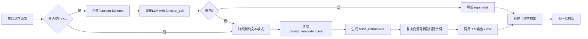

针对您提出的三个核心问题，我给出一个**简洁、稳定、可落地**的最终设计方案。

---

## 一、output_template 多模板存储

一个字段组可能需要生成多个输出（例如：服务记录文本、工单标题、通知内容等）。解决方案：

### 在 `field_group` 表中增加 `output_templates` 字段（JSONB）

```sql
ALTER TABLE field_group ADD COLUMN output_templates JSONB NOT NULL DEFAULT '{}';
```

**存储结构示例**：
```json
{
  "service_record_text": {
    "template": "车主{{ customer_name }}（{{ relation }}）{{ contact_phone }}请求道路救援。车架号：{{ vin_code }}。拖车目的地：{{ tow_destination }}。{{ notice_content }}",
    "description": "用于生成最终的服务记录文本"
  },
  "ticket_title": {
    "template": "{{ business_type }} - {{ customer_name }} - {{ contact_phone }}",
    "description": "工单标题"
  },
  "email_subject": {
    "template": "【道路救援】{{ customer_name }}的救援请求",
    "description": "邮件主题"
  }
}
```

- **调用方式**：前端请求时可通过参数 `?template_key=service_record_text` 指定需要的模板，服务端渲染后只返回该模板结果；或者默认返回所有模板的渲染结果。
- **模板引擎**：使用简单占位符 `{{ field_name }}`，后端用 Python `string.Template` 或 `Jinja2` 渲染。字段名与扁平化的 `field_spec.field_name` 一致。

**优点**：一个字段组支持任意多个输出，互不干扰，扩展方便。

---

## 二、field_spec 的初始设置与同步（三方下拉选项）

核心需求：从三方接口加载下拉选项，存入 `field_spec.options`，并支持后续接口变更同步及人工标注追加。

### 2.1 `options` 字段结构（JSONB）

```json
{
  "source": "api",                    // "api" 或 "static"
  "api_identifier": "business_types", // 三方接口标识，用于后台同步
  "last_sync_at": "2025-05-01T10:00:00Z",
  "items": [
    {
      "value": 1,
      "label": "售后投诉",
      "base_annotation": "用户提到'投诉'或情绪激动时选此项",
      "corrections": [
        {
          "id": "c1",
          "text": "当用户反复要求转人工且语气愤怒，也应选此项",
          "created_by": "客服张三",
          "created_at": "2025-05-01T11:00:00Z"
        }
      ],
      "is_deleted": false
    },
    {
      "value": 2,
      "label": "售后服务",
      "base_annotation": "用户提到'保养'、'维修'时选此项",
      "corrections": [],
      "is_deleted": false
    }
  ]
}
```

### 2.2 初始化流程（创建字段时）

1. 运营在后台添加一个 `select` 类型字段，选择“选项来源”为“三方接口”，并指定接口标识（如 `business_types`）。
2. 后端根据接口标识调用三方 API 获取选项列表（假设返回 `[{value:1, name:"售后投诉"}, ...]`）。
3. 将返回的每个选项转换为 `{value, label, base_annotation:"", corrections:[], is_deleted:false}` 存入 `options.items`。
4. 设置 `source="api"`, `api_identifier`, `last_sync_at`。
5. 保存到 `field_spec`。

### 2.3 同步更新机制（定期或手动）

编写一个后台任务（例如每天凌晨执行或通过管理界面手动触发）：

- 查询所有 `field_type='select'` 且 `options->>'source' = 'api'` 的字段。
- 对每个字段，根据 `options->>'api_identifier'` 调用对应的三方接口，获取最新列表。
- 对于接口返回的每个新选项：
  - 如果本地 `items` 中存在相同 `value` 的项：
    - 更新其 `label`（如果接口改了名称），保留原有的 `base_annotation` 和 `corrections`，设置 `is_deleted = false`。
  - 如果不存在：
    - 新增项，`base_annotation` 为空，`corrections` 为空，`is_deleted = false`。
- 对于本地 `items` 中存在但接口返回中不存在的项：
  - 设置其 `is_deleted = true`（不物理删除，保留历史标注）。
- 更新 `last_sync_at`。

**SQL 更新示例（使用 jsonb_set）**：略复杂，建议在应用层读取、修改、写回，字段数量不大，性能可接受。

### 2.4 人工标注

- 运营可以在管理界面直接修改某个选项的 `base_annotation`。
- 也可以追加 `corrections`（通过弹窗提交）。
- 这些修改不会被同步任务覆盖（因为同步只更新 `label` 和新增/软删除，不会动 `base_annotation` 和 `corrections`）。

---

## 三、生成 LLM Function Calling 的参数

运行时，根据 `field_spec` 动态生成 `enum` 和 `description`。

**伪代码**：

```python
def build_field_description(field):
    if field.field_type == 'text':
        desc = field.fill_instruction or ""
        # 追加全局 corrections（如果有）
        if field.corrections:
            corrections_text = "；".join([c['text'] for c in field.corrections])
            desc += f"；人工补充规则：{corrections_text}"
        return desc
    elif field.field_type == 'select':
        options = field.options['items']
        # 只取 is_deleted != true 的选项
        valid_options = [opt for opt in options if not opt.get('is_deleted', False)]
        option_descs = []
        enum_values = []
        for opt in valid_options:
            label = opt['label']
            enum_values.append(label)
            base = opt.get('base_annotation', '')
            corrections_list = opt.get('corrections', [])
            corrections_text = "；".join([c['text'] for c in corrections_list])
            full = f"{label}：{base}"
            if corrections_text:
                full += f"；人工补充：{corrections_text}"
            option_descs.append(full)
        description = f"可选值：{'；'.join(option_descs)}"
        if field.fill_instruction:
            description = field.fill_instruction + " " + description
        return description, enum_values
```

生成的 Function 示例：

```json
{
  "name": "fill_service_record_group",
  "parameters": {
    "type": "object",
    "properties": {
      "business_type": {
        "type": "string",
        "description": "业务类型。可选值：售后投诉：用户提到'投诉'或情绪激动时选此项；人工补充：当用户反复要求转人工且语气愤怒，也应选此项；售后服务：用户提到'保养'、'维修'时选此项。",
        "enum": ["售后投诉", "售后服务"]
      }
    }
  }
}
```

---

## 四、表结构最终版 SQL

```sql
-- 字段组表
CREATE TABLE field_group (
    id SERIAL PRIMARY KEY,
    app_name VARCHAR(64) NOT NULL,
    page_name VARCHAR(64) NOT NULL,
    group_name VARCHAR(128) NOT NULL,
    prompt_template_base TEXT NOT NULL,  -- 包含 {{fields_instructions}} 和 {{conversation}}
    output_templates JSONB NOT NULL DEFAULT '{}',  -- 多模板存储
    is_active BOOLEAN DEFAULT TRUE,
    version INT DEFAULT 1,
    created_at TIMESTAMP DEFAULT NOW(),
    updated_at TIMESTAMP DEFAULT NOW(),
    UNIQUE(app_name, page_name, group_name)
);

-- 字段规格表
CREATE TABLE field_spec (
    id SERIAL PRIMARY KEY,
    group_id INT NOT NULL REFERENCES field_group(id) ON DELETE CASCADE,
    field_name VARCHAR(64) NOT NULL,
    field_label VARCHAR(128) NOT NULL,
    field_type VARCHAR(16) NOT NULL CHECK (field_type IN ('text', 'select')),
    is_required BOOLEAN DEFAULT FALSE,
    fill_instruction TEXT,
    options JSONB,                     -- select类型的选项配置（含标注、同步信息）
    corrections JSONB DEFAULT '[]'::JSONB,  -- text类型的全局批注
    sort_order INT DEFAULT 0,
    created_at TIMESTAMP DEFAULT NOW(),
    updated_at TIMESTAMP DEFAULT NOW(),
    UNIQUE(group_id, field_name)
);

-- 索引
CREATE INDEX idx_field_spec_group ON field_spec(group_id);
```

---

## 五、API 和调用流程

1. **前端请求填单**：
   ```
   POST /autofill
   {
     "app_name": "400客服",
     "page_name": "话务工作台",
     "group_name": "service_record_group",
     "conversation": "用户：我要投诉...",
     "template_keys": ["service_record_text"]  // 可选，指定需要的模板
   }
   ```

2. **后端处理**：
   - 查询字段组及字段列表。
   - 动态生成 Function Schema。
   - 调用 LLM，获得扁平 JSON 结果。
   - 根据 `template_keys` 渲染模板：遍历 `field_group.output_templates`，对该请求指定的 key 进行渲染（使用 LLM 返回的字段值）。
   - 返回：
     ```json
     {
       "fields": { "business_type": "售后投诉", "customer_name": "张三", ... },
       "rendered_templates": {
         "service_record_text": "车主张三...请求道路救援..."
       }
     }
     ```

3. **前端展示**：直接使用 `fields` 填充表单各控件，同时展示 `rendered_templates` 中的文本供客服确认。

---

## 六、维护与人工标注界面

- **字段管理界面**：列表展示所有字段，支持编辑 `fill_instruction`、`options.items` 中的 `base_annotation`，以及查看/追加 `corrections`。
- **同步操作**：提供一个“从接口同步”按钮，手动触发指定字段的同步任务。
- **批注弹窗**：客服在前端点击字段反馈时，直接调用后端接口追加 `corrections`（针对 text 字段）或某个选项的 `corrections`。

---

## 总结

这个方案实现了：
1. **多模板存储**：`output_templates` JSONB 字段，灵活支持任意数量输出。
2. **三方下拉选项管理**：`options` 结构存储接口源及合并数据，支持后台同步，人工标注永不丢失。
3. **运行时动态生成**：每次请求实时生成 Function Schema，人工反馈立即生效。
4. **简洁稳定**：只有两张核心表，无复杂自关联，所有扩展信息都放在 JSONB 中，既有关系型约束的严谨，又有 NoSQL 的灵活。


好的，增加 **纯文本提示词回退方案**：当 Function Calling 不可用（模型不支持、失败、或降级）时，使用同样动态生成的 `prompt_template_base` 让 LLM 直接输出结构化 JSON。这要求提示词设计得足够严谨，能够约束输出格式和取值范围。

下面给出完整的生成逻辑、模板内容以及如何与现有字段配置结合。

---

## 一、`prompt_template_base` 的标准模板内容

存储在 `field_group` 表中的 `prompt_template_base` 是一个**固定框架**，包含占位符 `{{fields_instructions}}` 和 `{{conversation}}`。例如：

```text
你是一个智能填单助手。请根据以下对话内容，填写表单中的各个字段。

## 字段填写说明
{{fields_instructions}}

## 对话内容
{{conversation}}

## 输出要求
- 你必须输出一个**合法的 JSON 对象**，不要包含任何其他解释或前缀。
- JSON 对象的 key 必须与上述字段名称完全一致。
- 对于「选择」类型的字段，必须从给出的选项中选择一个值。
- 如果某个字段无法从对话中确定，请填写空字符串（""）。
- 输出示例：{"field1": "value1", "field2": "value2"}

请直接输出 JSON：
```

这个模板存储后，每次请求时由后端动态替换 `{{fields_instructions}}` 和 `{{conversation}}`。

---

## 二、生成 `fields_instructions` 的逻辑

`fields_instructions` 是一个字符串，包含每个字段的详细填写指引（与 Function Calling 的描述完全一致，以保证两种方式行为相同）。生成逻辑复用 `build_field_description` 函数。

### 伪代码

```python
def build_fields_instructions(fields: List[FieldSpec]) -> str:
    lines = []
    for f in sorted(fields, key=lambda x: x.sort_order):
        if f.field_type == 'text':
            desc = f.fill_instruction or "根据对话内容提取"
            if f.corrections:
                corrections_text = "；".join([c['text'] for c in f.corrections])
                desc += f"。人工补充规则：{corrections_text}"
            lines.append(f"- {f.field_label}（字段名：`{f.field_name}`）：{desc}")
        
        elif f.field_type == 'select':
            # 获取有效选项（未删除）
            items = [opt for opt in f.options.get('items', []) if not opt.get('is_deleted', False)]
            option_strs = []
            allowed_values = []
            for opt in items:
                label = opt['label']
                allowed_values.append(label)
                base = opt.get('base_annotation', '')
                corrections_list = opt.get('corrections', [])
                corrections_text = "；".join([c['text'] for c in corrections_list])
                full_desc = f"{label}：{base}" + (f"；人工补充：{corrections_text}" if corrections_text else "")
                option_strs.append(f"  - {full_desc}")
            
            options_block = "可选值：\n" + "\n".join(option_strs)
            global_inst = f.fill_instruction or "根据用户意图选择"
            lines.append(f"- {f.field_label}（字段名：`{f.field_name}`）：{global_inst}\n{options_block}\n  只能从上述选项中选择一个值。")
    
    return "\n".join(lines)
```

**生成示例**：

```text
- 业务类型（字段名：`business_type`）：根据用户意图选择
可选值：
  - 售后投诉：用户提到'投诉'或情绪激动时选此项；人工补充：当用户反复要求转人工且语气愤怒，也应选此项
  - 售后服务：用户提到'保养'、'维修'时选此项
只能从上述选项中选择一个值。
- 客户姓名（字段名：`customer_name`）：提取客户真实姓名或称呼。人工补充规则：如果用户说'我姓王'，填写'王先生'。
```

---

## 三、完整请求构造（回退模式）

当明确使用纯文本模式（例如前端参数 `use_fc=false` 或 FC 失败后重试），后端按以下步骤构造请求：

```python
# 1. 获取字段组配置
group = get_field_group(app_name, page_name, group_name)
fields = get_fields_by_group(group.id)

# 2. 生成 fields_instructions
fields_instructions = build_fields_instructions(fields)

# 3. 替换模板
prompt = group.prompt_template_base.replace("{{fields_instructions}}", fields_instructions)
prompt = prompt.replace("{{conversation}}", conversation)

# 4. 调用 LLM（不带 function）
response = openai.ChatCompletion.create(
    model="gpt-4",
    messages=[
        {"role": "system", "content": "你是一个结构化数据提取专家，只输出 JSON。"},
        {"role": "user", "content": prompt}
    ],
    temperature=0.0,          # 低温度提高稳定性
    response_format={"type": "json_object"}  # 如果模型支持，强制 JSON；否则靠提示词约束
)

# 5. 解析 JSON
result = json.loads(response.choices[0].message.content)
```

---

## 四、输出验证与修正

由于纯文本模式下 LLM 可能输出不符合预期的字段值（例如 select 字段输出不在枚举中的值），需要增加验证步骤：

```python
def validate_and_fix(result: dict, fields: List[FieldSpec]) -> dict:
    for f in fields:
        value = result.get(f.field_name)
        if value is None:
            if f.is_required:
                result[f.field_name] = ""  # 或默认值
            continue
        
        if f.field_type == 'select':
            allowed_labels = [opt['label'] for opt in f.options['items'] if not opt.get('is_deleted', False)]
            if value not in allowed_labels:
                # 尝试模糊匹配（如用户写"售后"匹配"售后服务"），否则清空
                matched = next((label for label in allowed_labels if value in label or label in value), None)
                result[f.field_name] = matched if matched else ""
        
        elif f.field_type == 'text':
            # 可做简单清洗（如去除多余换行）
            result[f.field_name] = str(value).strip()
    
    return result
```

这样确保最终输出的 JSON 符合字段组的定义，可以安全地交给前端渲染或存储。

---

## 五、与 Function Calling 方案的统一

- **共享字段描述生成函数** `build_fields_instructions`：FC 中的 `description` 也是基于同样的逻辑构建（只不过放入 JSON Schema 的 `description` 中）。
- **一致性保证**：无论使用 FC 还是纯文本，LLM 接收到的字段含义、选项约束、人工批注都完全相同，因此填单结果应该高度一致。
- **切换策略**：可以优先使用 FC（更稳定），如果模型不支持或连续失败，自动降级到纯文本模式；也可以让前端通过参数选择。

---

## 六、管理界面如何编辑 `prompt_template_base`

由于模板中除了 `{{fields_instructions}}` 和 `{{conversation}}` 外可以包含任何文字，建议在管理后台提供一个**只读示例**，并允许运营人员修改固定文案（例如“你是一个智能填单助手”可以改为更贴合业务的描述）。但必须警告不要删除占位符。

- **存储示例**：
  ```text
  你是一个专业的客服填单机器人。请根据对话内容填写以下表单。

  ## 表单字段说明
  {{fields_instructions}}

  ## 对话历史
  {{conversation}}

  ## JSON 输出格式
  请直接输出一个 JSON 对象，不要有其他解释。确保所有字段都填写，无法确定的填空字符串。

  输出：
  ```

- **初始化创建字段组时**，系统自动生成一个合理的默认模板，管理员可在此基础上微调。

---

## 七、完整流程图



---

## 八、总结

- `prompt_template_base` 存储在数据库中，是一个带有 `{{fields_instructions}}` 和 `{{conversation}}` 占位符的文本模板。
- 每次请求动态生成 `fields_instructions`，逻辑与 Function Calling 的描述生成共用，保证两种模式行为一致。
- 纯文本模式通过严格的提示词和输出验证，确保 LLM 输出合法且取值正确的 JSON。
- 提供降级路径，提高系统鲁棒性。
